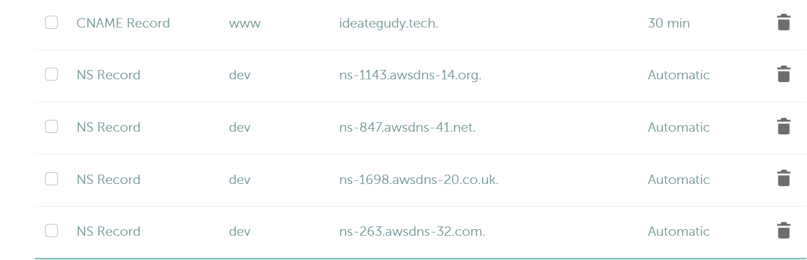
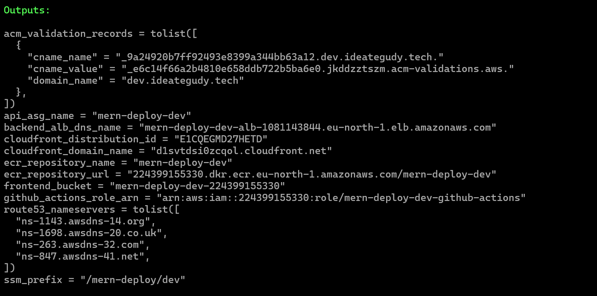
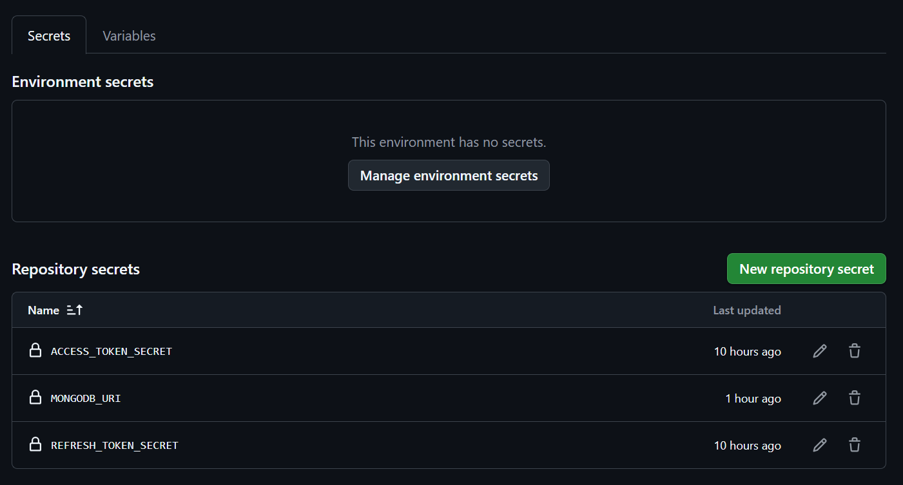
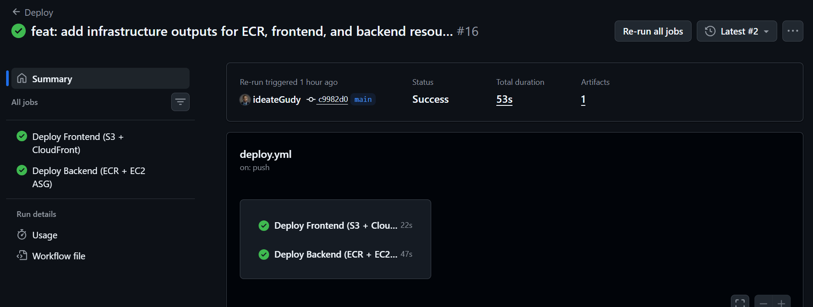

# How I Built and Deployed a Production-Grade MERN App on AWS using Modular Terraform and Keyless GitHub Actions OIDC 🚀

Deploying a full-stack web application into production is often one of the most daunting steps for modern developers. You build a great MERN (MongoDB, Express, React, Node.js) app locally, but when it comes to hosting it securely on cloud infrastructure with HTTPS, custom domains, and automated deployment pipelines, things can quickly get overwhelming.

In this post, I will break down **how I architected, provisioned, and deployed a production-grade MERN stack app ("Little List") on AWS** using **Terraform** for Infrastructure as Code (IaC), **Amazon S3 + CloudFront** for the frontend SPA, **Docker + EC2 Auto Scaling + ALB** for the backend API, and **Keyless GitHub Actions OIDC** for CI/CD.

Whether you are a beginner looking to understand modern cloud infrastructure or an experienced engineer reviewing multi-environment Terraform design, this guide has something for you!

---

## 📋 Prerequisites

Before diving in, here is what you will need if you want to replicate this deployment architecture:

1. **AWS Account**: An active AWS account with permissions to manage EC2, S3, CloudFront, ECR, IAM, and Route 53.
2. **Terraform CLI**: Installed on your machine (`>= 1.16.2`).
3. **AWS CLI**: Installed and configured with your credentials (`aws configure`).
4. **Docker**: Installed locally for testing container builds.
5. **Node.js & npm**: Installed locally for building the frontend.
6. **GitHub Account**: A repository containing your MERN codebase.
7. **Custom Domain (Optional)**: A domain registered on Namecheap, GoDaddy, or Route 53 if you want custom SSL support (e.g., `ideategudy.tech`).

---

## 🏗️ The Cloud Architecture Overview

Before writing code, let us look at the high-level architecture diagram of what we are provisioning on AWS:

```
                         ┌──────────────────────┐
                         │    GitHub Actions    │
                         └──────────┬───────────┘
                                    │
                  ┌─────────────────┴─────────────────┐
                  │                                   │
            Frontend deploy                      Backend deploy
                  │                                   │
                  ▼                                   ▼
          ┌───────────────┐                    ┌───────────────┐
          │      S3       │                    │      ECR      │
          │ React build   │                    │ Docker image  │
          └───────┬───────┘                    └───────┬───────┘
                  │                                    │
                  ▼                                    │ docker pull
          ┌───────────────┐                            │
          │  CloudFront   │                            ▼
          │  CDN (HTTPS)  │                    ┌───────────────┐
          └───────┬───────┘                    │      EC2      │
                  │                            │ Express/Docker│
                  │                            └───────┬───────┘
                  │                                    │
                  │                            ┌───────┴───────┐
                  │                            │      ASG      │
                  │                            │  EC2 fleet    │
                  │                            └───────┬───────┘
                  │                                    │
                  │                            ┌───────▼───────┐
                  └────────────────────────────│      ALB      │
                                               │ Load Balancer │
                                               └───────────────┘
                                                        │
                                                        ▼
                                                   Express API
```

### Core Components Explained for Beginners:

- **Amazon S3**: Hosts the static, compiled single-page React frontend (`dist/` build files) privately.
- **Amazon CloudFront**: A global Content Delivery Network (CDN) that serves the React app over HTTPS and acts as a single reverse proxy for both client and backend requests.
- **Amazon ECR (Elastic Container Registry)**: Private Docker image registry to store backend container builds.
- **AWS ALB (Application Load Balancer)**: Receives API traffic from CloudFront and balances requests across EC2 instances.
- **AWS Auto Scaling Group (ASG)**: Manages an auto-healing fleet of EC2 instances running Canonical Ubuntu 24.04 LTS and Docker.
- **GitHub OIDC (OpenID Connect)**: Allows GitHub Actions to obtain short-lived security tokens to deploy to AWS **without storing permanent AWS Secret Access Keys in GitHub**.

---

## 📂 Repository & Project Structure

Here is how the project files are structured:

```
.
├── client/                     # Vite + React SPA Frontend
├── server/                     # Node.js + Express API Backend (Dockerized)
├── infra/                      # Modular Terraform Infrastructure
│   ├── main.tf                 # Root Terraform Module
│   ├── variables.tf            # Root Variables & Configuration Defaults
│   ├── outputs.tf              # Root Terraform Outputs
│   ├── versions.tf             # AWS & Provider Requirements
│   ├── dev.tfvars.example      # Development Environment Settings
│   ├── prod.tfvars.example     # Production Environment Settings
│   └── modules/
│       ├── vpc/                # VPC, Public Subnets (2 AZs), IGW, Route Tables
│       ├── backend/            # ECR, ALB, ASG, Launch Template, EC2 IAM Role
│       ├── frontend/           # S3 Bucket, CloudFront OAC, CDN Distribution, Route53/ACM
│       └── github_oidc/        # GitHub OIDC Identity Provider & IAM Role
└── .github/
    └── workflows/
        └── deploy.yml          # Parallel CI/CD Workflow (Frontend & Backend)
```

---

## 🧱 Key Technical Deep Dives

### 1. Unified Single-Domain Routing with CloudFront
One common challenge with SPA + API setups is CORS and handling multiple URLs (`api.domain.com` vs `domain.com`). We solved this by serving **both frontend and backend under the exact same domain (`https://dev.ideategudy.tech`)** via CloudFront Path-Based Routing:

| Request Path Pattern | Origin Target | Description |
|---|---|---|
| `/` or `/assets/*` | `s3-frontend` | Serves static React SPA files |
| `/api/*`, `/s/*`, `/healthz` | `alb-api` | Forwards API requests directly to the EC2/Express backend |

> 💡 **Pro-Tip**: When forwarding requests through CloudFront to an ALB, ensure your CloudFront cache behavior explicitly forwards the `Authorization`, `Accept`, `Content-Type`, `Origin`, and `Referer` headers! Otherwise, CloudFront strips the `Authorization: Bearer <jwt>` header by default, leading to `401 Unauthorized` errors on authenticated routes.

### 2. Zero Secrets in GitHub via AWS OIDC
Instead of creating long-lived IAM user keys (`AWS_ACCESS_KEY_ID` and `AWS_SECRET_ACCESS_KEY`) and pasting them into GitHub Secrets, we configured an **AWS IAM OIDC Identity Provider**.

GitHub Actions assumes a temporal AWS IAM Role dynamically per pipeline run using OpenID Connect authentication. If your pipeline is compromised, there are no static credentials to leak!

---

## 🌐 Custom Domain (`ideategudy.tech`) & SSL Configuration

Primary infrastructure resources (VPC, EC2, ASG, ALB, ECR, S3) are deployed in `eu-north-1` (Stockholm). HTTPS is terminated at the CloudFront CDN level using **AWS Certificate Manager (ACM)** in `us-east-1` (required by CloudFront for global edge distributions).

### Connecting Namecheap Domain / Subdomain (`dev.ideategudy.tech`) to AWS:

1. In `infra/dev.tfvars` (or `prod.tfvars`):
   ```hcl
   domain_name         = "dev.ideategudy.tech"
   create_route53_zone = true
   ```
2. Run `terraform apply --var-file="dev.tfvars"`.
3. Copy the 4 output nameservers from Terraform:
   ```hcl
   route53_nameservers = [
     "ns-1143.awsdns-14.org",
     "ns-1698.awsdns-20.co.uk",
     "ns-263.awsdns-32.com",
     "ns-847.awsdns-41.net"
   ]
   ```
4. Log into **Namecheap** -> **Domain List** -> **Manage `ideategudy.tech`** -> **Advanced DNS** (or **Custom DNS** / **NS Records**) and paste the 4 Route 53 Nameservers for your subdomain `dev.ideategudy.tech`.


> *Figure: Configured NS records in Namecheap pointing `dev.ideategudy.tech` to AWS Route 53.*

5. In minutes, free auto-renewing SSL is active across `https://dev.ideategudy.tech`!


---

## ⚡ Automated CI/CD Pipeline (`deploy.yml`)

When code is pushed to `main`, GitHub Actions triggers `.github/workflows/deploy.yml` which executes **two parallel jobs**:

> 💡 **Note for Beginners**: You do **not** need to manually build the React frontend or Docker container on your local computer before pushing. GitHub Actions automatically compiles the React production bundle and builds/pushes the Docker image in the cloud during the pipeline run!

1. **`deploy-frontend`**:
   - Builds Vite/React bundle.
   - Authenticates keylessly to AWS via OIDC.
   - Syncs static assets to the private S3 bucket (`aws s3 sync`).
   - Invalidates CloudFront edge cache (`aws cloudfront create-invalidation`).

2. **`deploy-backend`**:
   - Builds Docker image for Express API.
   - Authenticates to Amazon ECR via OIDC.
   - Pushes new Docker tag to ECR.
   - Syncs runtime application secrets into AWS SSM Parameter Store (`/mern-deploy/dev/...`).
   - Executes zero-downtime container updates across EC2 ASG instances via AWS SSM `RunShellScript`.

---

## 🚀 Step-by-Step Deployment Instructions

### Step 1: Provision AWS Infrastructure with Terraform
```bash
cd infra

# Copy example variables
cp dev.tfvars.example dev.tfvars

# Edit values in dev.tfvars (domain_name, github_org, github_repo)
terraform init
terraform plan --var-file="dev.tfvars"
terraform apply --var-file="dev.tfvars" --auto-approve
```


> *Figure 1: Successful `terraform apply` showing outputs for S3, CloudFront, ECR, and ALB.*

### Step 2: Configure GitHub Repository Secrets & Variables
In your GitHub repo under **Settings -> Secrets and variables -> Actions**:

> 💡 *Tip: You can retrieve all your Terraform output values anytime by running `terraform output` inside the `infra/` folder.*


> *Figure 2: GitHub Actions repository variables and secrets configured for OIDC deployment.*


- **Secrets**:
  - `MONGODB_URI`: MongoDB connection string
  - `ACCESS_TOKEN_SECRET`: JWT access secret
  - `REFRESH_TOKEN_SECRET`: JWT refresh secret

- **Variables**:
  - `AWS_ROLE_ARN`: Output `github_actions_role_arn`
  - `AWS_REGION`: `eu-north-1`
  - `ECR_REPOSITORY`: Output `ecr_repository_name`
  - `FRONTEND_BUCKET`: Output `frontend_bucket`
  - `CLOUDFRONT_DISTRIBUTION_ID`: Output `cloudfront_distribution_id`
  - `API_ASG_NAME`: Output `api_asg_name`
  - `SSM_PREFIX`: Output `ssm_prefix`
  - `CLIENT_URL`: `https://dev.ideategudy.tech`
  - `SERVER_URL`: `https://dev.ideategudy.tech`

### Step 3: Trigger Automated Build & Deployment
Push your updates to the repository:
```bash
git add .
git commit -m "Deploy production architecture to AWS"
git push origin main
```


> *Figure 3: Parallel CI/CD execution for `deploy-frontend` and `deploy-backend` jobs.*


---

## 🎉 Live Application Demo


> *Figure 4: The live full-stack application running on `https://dev.ideategudy.tech` served securely over CloudFront HTTPS.*

---

## ⚡ Key Benefits of This Architecture

Choosing this cloud setup over monolithic single-server hosting provides several high-value production advantages:

1. **🚀 Zero-Downtime & Ultra-Fast Global Delivery**: 
   By hosting the React SPA on **Amazon S3 + CloudFront**, static assets are cached globally at edge locations close to users. CloudFront delivers lightning-fast page loads while shielding your backend EC2 instances from static file requests.

2. **💰 Extreme Cost Optimization (Free Tier Friendly)**:
   - **S3 & CloudFront**: Nearly zero cost for static SPA bandwidth.
   - **EC2 Auto Scaling**: Scales t3.micro instances based on CPU utilization and traffic demands without paying for oversized idle instances.
   - **Amazon ECR Lifecycle Policies**: Configured to auto-expire old image tags, keeping container storage well under free-tier limits.

3. **🔒 Enterprise-Grade Keyless Security (OIDC)**:
   By avoiding permanent `AWS_ACCESS_KEY_ID` and `AWS_SECRET_ACCESS_KEY` credentials in GitHub Secrets, your deployment security posture is greatly hardened. GitHub Actions requests temporary, short-lived IAM credentials via OIDC scoped strictly to the resources it needs.

4. **🛡️ High Availability & Auto-Healing**:
   The **Application Load Balancer (ALB)** and **Auto Scaling Group (ASG)** automatically monitor EC2 instance health. If an instance crashes or fails health checks, ASG automatically terminates it and launches a fresh, containerized replacement instance seamlessly.

5. **📦 Modular & Multi-Environment Ready**:
   The modular Terraform layout (`vpc`, `backend`, `frontend`, `github_oidc`) makes it effortless to spin up separate `dev`, `staging`, and `production` environments in minutes with zero manual AWS Console clicking.

---

## 🎯 Conclusion

Building cloud infrastructure using modular Terraform modules and automated keyless CI/CD pipelines transforms complex AWS operations into predictable, repeatable, and maintainable software engineering workflows.

By decoupling the architecture into public VPC subnets, S3/CloudFront SPA hosting, and auto-scaling EC2 container fleets, the application stays fast, cost-optimized, and resilient.


---

## 🤝 Connect & Follow Me

If you found this guide helpful or have any questions about AWS, Terraform, Docker, or MERN stack architecture, let us connect!

- 🐙 **GitHub**: [github.com/ideateGudy](https://github.com/ideateGudy)
- 💼 **LinkedIn**: [linkedin.com/in/ideategudy](https://www.linkedin.com/in/ideategudy/)

*Drop a reaction on Dev.to and feel free to star the GitHub repository! Happy coding!* 🚀

